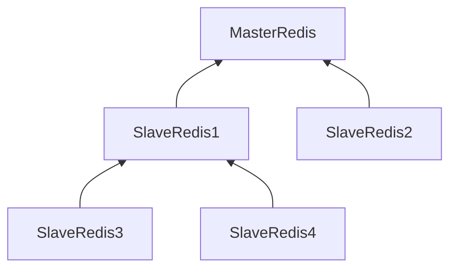

# Redis持久化方案
Redis 为我们提供了2个持久化方案 RDB和AOF   
Redis启动后会读取RDB快照文件，将数据从硬盘载入到内存。根据数据量大小与结构和服务器性能不同，这个时间也不同。（参考数据：记录一千万个字符串类型键、大小为1GB的快照文件载入到内存中需要花费20～30秒钟。）


## RDB持久化（Redis默认）
RDB方式的持久化是**通过快照（snapshotting）**完成的，当符合一定条件时Redis会自动将内存中的数据**进行快照并持久化到硬盘**。

### 持久化条件配置
在redis.conf 配置文件中我们可以配置多个持久化条件
``` sh
################################
#
# Save the DB on disk:
#
#   save <seconds> <changes>
#
#   Will save the DB if both the given number of seconds and the given
#   number of write operations against the DB occurred.
#
#   In the example below the behaviour will be to save:
#   after 900 sec (15 min) if at least 1 key changed
#   after 300 sec (5 min) if at least 10 keys changed
#   after 60 sec if at least 10000 keys changed
#
#   Note: you can disable saving completely by commenting out all "save" lines.
#
#   It is also possible to remove all the previously configured save
#   points by adding a save directive with a single empty string argument
#   like in the following example:
#
#   save ""
save 900 1
save 300 10
save 60 10000
```
以 `save 900 1` 为例，表示900秒内至少一个键值被更改就进行快照操作（写入生成快照保存到磁盘）   
有多个持久化条件 满足一个就会触发操作

### 配置RDB快照文件名和保存位置
在redis.conf 配置文件中 我们可以定义快照路径默认生成在redis.conf同路径下
``` sh
# The working directory.
#
# The DB will be written inside this directory, with the filename specified
# above using the 'dbfilename' configuration directive.
#
# The Append Only File will also be created inside this directory.
#
# Note that you must specify a directory here, not a file name.
dir ./
```
在 redis.conf 配置文件中 我们可以定义快照文件名称 默认为`dump.rdb`
``` sh
# The filename where to dump the DB
dump.rdb
```

### RDB持久化优缺点
- 优点   
与AOF持久化比较，对磁盘写入次数少，所以对磁盘损耗小。

- 缺点  
通过RDB方式实现持久化，一旦Redis异常退出，就会丢失最后一次快照之后更改的所有数据

如果数据很重要以至于无法承受任何损失，则可以考虑使用AOF方式进行持久化。


## AOF持久化
AOF持久化采取操作(除查询)一次数据库，就会进行一次持久化操作（写入磁盘）   
默认情况下Redis没有开启AOF（append only file）的持久化方式需要手动开启   
在 redis.conf 配置文件中 修改 `appendonly` 参数为yes
``` sh
# AOF and RDB persistence can be enabled at the same time without problems.
# If the AOF is enabled on startup Redis will load the AOF, that is the file
# with the better durability guarantees.
#
# Please check http://redis.io/topics/persistence for more information.

appendonly yes
```


### 配置AOF快照文件名和保存位置
保存位置配置与RDB 配置相同 都是修改redis.conf 中dir的参数设置
在redis.conf 配置文件中 我们可以定义快照路径默认生成在redis.conf同路径下
``` sh
# The working directory.
#
# The DB will be written inside this directory, with the filename specified
# above using the 'dbfilename' configuration directive.
#
# The Append Only File will also be created inside this directory.
#
# Note that you must specify a directory here, not a file name.
dir ./
```
在redis.conf 配置文件中 我们可以修改`appendfilename` 参数设置AOF生成的文件名
``` sh 
# The name of the append only file (default: "appendonly.aof")

appendfilename "appendonly.aof"

```


# Redis的主从复制
## 主从复制介绍
持久化保证了即使redis服务重启也不会丢失数据，因为redis服务重启后会将硬盘上持久化的数据恢复到内存中，但是当redis服务器的硬盘损坏了可能会导致数据丢失，如果通过redis的**主从复制机制就可以避免这种单点故障**

举例：我们设置了3台Redis服务器    
分别为：主Redis（master）、从Redis1（slave）、从Redis2（slave）
- 主redis中的数据有两个副本（replication）即从redis1和从redis2，即使一台redis服务器宕机其它两台redis服务也可以继续提供服务。
- 主redis中的数据和从redis上的数据保持实时同步，当主redis写入数据时通过主从复制机制复制到两个从redis服务上。
- 只有一个主redis，可以有多个从redis。
- 主从复制不会阻塞master，在同步数据时，master 可以继续处理client 请求
- 一个redis可以即是主又是从，如下图：

## 配置
### redis主服务器配置
无需特殊配置
### redis从服务器配置
1. 通过 redis.conf 设置主服务器ip地址和端口号
    ``` sh
    # slaveof <masterip> <masterport>
    slaveof 192.168.1.1 6379
    ```
2. 检从机redis是否存在持久化文件，若存在需要删除
3. 启动从机redis服务（启动时必须加载redis.conf）
    ``` sh
    ./redis-server redis.conf
    ```
4. 测试在主redis测试写入数据，在从机中读取数据（从机只有读取权限）

# Redis集群
## 集群(redis-cluster)架构图


架构细节:
1. 所有的redis节点彼此互联(PING-PONG机制),内部使用二进制协议优化传输速度和带宽   
2. 节点的fail是通过集群中超过半数的节点检测失效时才生效   
3. 客户端与redis节点直连,不需要中间proxy层.客户端不需要连接集群所有节点,连接集群中任何一个可用节点即可   
4. redis-cluster把所有的物理节点映射到[0-16383]slot槽上,cluster 负责维护node<->slot<->value  

Redis 集群中内置了 16384 个哈希槽，当需要在 Redis 集群中放置一个 key-value 时，redis 先对 key 使用 crc16 算法算出一个结果，然后把结果对 16384 求余数，这样每个 key 都会对应一个编号在 0-16383 之间的哈希槽，redis 会根据节点数量大致均等的将哈希槽映射到不同的节点


## redis-cluster投票:容错


1. 集群中所有master参与投票,如果半数以上master节点与其中一个master节点通信超时(cluster-node-timeout),认为该master节点挂掉.
2. 什么时候整个集群不可用(cluster_state:fail)? 
   - 如果集群任意master挂掉,且当前master没有slave，则集群进入fail状态。也可以理解成集群的[0-16383]slot映射不完全时进入fail状态。
   - 如果集群超过半数以上master挂掉，无论是否有slave，集群进入fail状态。

## 搭建Ruby环境
redis集群管理工具redis-trib.rb依赖ruby环境，首先需要安装ruby环境
1. 安装 ruby
    ```
    # yum install ruby
    # yum install rubygems
    ```
2. 使用工具上传redis-3.0.0.gem至/usr/local下
3. 安装ruby和redis的接口程序
    ``` sh
     gem install /usr/local/redis-3.0.0.gem
    ```
4. 将Redis集群搭建脚本文件复制到/usr/local/redis/redis-cluster目录下
    ``` sh
     cd /root/redis-3.0.0/src/
     ll *.rb
     cp redis-trib.rb /usr/local/redis/rediscluster/ -r
     ```
## 集群搭建
搭建集群最少也得需要3台主机，如果每台主机再配置一台从机的话，则最少需要6台机器。
1. 在每台服务器安装Redis
2. 使用命令redis-trib.rb 脚本创建集群,过程中根据提示输入`yes`
    ``` sh
    ./redis-trib.rb create --replicas 1 192.168.242.137:7001 192.168.242.137:7002 192.168.242.137:7003 192.168.242.137:7004 192.168.242.137:7005  192.168.242.137:7006
    ```
## 集群的常用命令
### 连接集群
- -p 表示指定端口
- -c 表示已集群方式连接
``` sh
./redis-cli –h 127.0.0.1 –p 7001 -c
```
### 查看集群状态
``` sh
cluster info
```

### 查看集群中的节点
``` sh
cluster nodes
```

